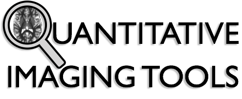

Credit / Blame / Contact - Tobias Wood - tobias.wood@kcl.ac.uk

This Source Code Form is subject to the terms of the Mozilla Public
License, v. 2.0. If a copy of the MPL was not distributed with this
file, You can obtain one at http://mozilla.org/MPL/2.0/.
 
If you find the tools useful the author would love to hear from you.

This is the updated version of QUIT based on ITK http://www.itk.org
The previous version is here http://github.com/spinicist/old_quit

# Brief Description #

A collection of programs for processing quantitative MRI data, originally DESPOT
but now a wider variety of techniques.

# Thanks #

Many thanks to Samuel Hurley for many, many suggestions.
Thanks to Anna Combes, Amy McDowell and Sjoerd Vos for finding bugs.

# Documentation #

Documentation exists in Markdown format in the Docs folder, and is also available at
http://spinicist.github.io/QUIT/

# Installation #

## Dependencies & Requirements ##

1. A C++11 compliant compiler (GCC 4.8.0+, Clang 3.1+)
2. CMake version 3.2 or higher (http://www.cmake.org)
3. Eigen version 3.2.4 or higher (http://eigen.tuxfamily.org)
4. ITK version 4.10.0 (http://www.itk.org)

WARNING - You will require a recent compiler for DESPOT as it uses C++11
features. GCC 4.8.0 is a MINIMUM as earlier versions do not support C++11
threads. Clang 3.1 will also work. You can find out the version of your
system gcc by running `gcc -v`.

## Compilation ##

If you are unfamiliar with C++/CMake/git etc. a script is provided that should
be able to build the tools provided the right software is available on your 
system. To use it, download and untar/unzip QUIT. In a terminal window, change
directory to where you unpacked QUIT. Then type `./easy_build.sh`. This will
download Eigen, ITK & CppNumericalSolvers into subdirectories, and then compile
QUIT in a '/Build' subdirectory. You can then use the tools by adding that
directory to your PATH environment variable.

If you are familiar with C++/CMake/git etc. then you compiling QUIT should be
straightforward. ITK & CppNumericalSolvers are included as git submodules for
convenience, however given the size of the ITK library you may wish to use a
system version of ITK instead of the submodule. The rough steps are:

1. Check you have the Eigen library available and download it if not.
2. Type the following commands if using the submodules: 
`git clone --recursive https://github.com/spinicist/QUIT.git`
`cd QUIT`
`git submodule init; git submodule update`
3. Compile ITK following their instructions (create a build directory and use
cmake/ccmake).
4. Create a build directory for QUIT and use cmake/ccmake to configure the
project. Specify the paths to Eigen and ITK. It is likely that CMake will
report an error on the first 'Configure' attempt if it cannot locate Eigen.
5. After configuring and generating, run 'make -j'.

# Usage #

There are some example scripts for processing pipelines in the /Scripts
directory. These print usage instructions if you call them with no arguments.
They take a set of filenames as input, and you will need to modify the scripts
with your particular flip-angles and TRs.

Each product has some basic usage instructions that will be printed with either
the -h or --help options, e.g. “qimcdespot -h". The programs will then prompt you
to enter flip-angles, TRs, etc. as they require based on your input options.

Once you are used to the input format, I recommend writing down the input in a
plain text file, and then using either the redirect operator (“<“) or a HEREDOC
(“<<“)to pass the input to your program. If you do this, you can suppress the
prompts to enter input with the “-n” option. So to run DESPOT1-HIFI you would
type:

	qidespot1hifi -m mask_file.niispgr_file.nii irspgr_file.nii < in.txt

where “in.txt” is a file containing:

	# A # symbol means a comment
	3 18   # SPGR flip-angles
	0.0083 # SPGR TR in SECONDS, not milli-seconds
	5      # IR-SPGR readout flip-angle
	0.0083 # IR-SPGR readout TR
	92     # IR-SPGR echo train length
	0.45   # IR-SPGR TI in SECONDS

Because QUIT is based on ITK, in theory it supports multiple image formats.
However I have only tested it with NIFTI.

# Description of Tools and Citations #

NOTE - This section will migrate to the Wiki eventually.

In alphabetical order:

1. qiaffine - Applies simple affine transformations directly to image headers (i.e. it does not alter the image data). It was written specifically for fixing pre-clinical images.
2. qiafi - Calculates a B1+ map from Actual Flip-angle Imaging data. See Yarnykh, MRM 2007 & Yarnykh, MRM 2010.
3. qicomplex - Converts between magnitude/phase/real/imaginary/complex data. Exists because of a bug in fslcomplex.
4. qidespot1 - Calculates a T1 map using the DESPOT1/VFA method. Includes weighted least-squares (see Chang MRM 2008) and non-linear least-squares fitting as well as the classic least-squares algorithm (there are multiple references for this, e.g. Gupta JMR 1977)
5. qidespot1hifi - Calculates a T1 and B1+ map simultaneously. See Deoni JMRI 2007. Thanks to Michael Thrippleton for corrected equations.
6. qidespot2 - Calculates a T2 map. Only useful for band-free data, i.e. 1.5T or below.
7. qidespot2fm - Calculates a T2 and f0 (off-resonance) map simultaneously. See Deoni JMRI 2009.
8. qihdr - Prints basic header information from a file.
9. qikfilter - Applies frequency domain filters to images, e.g. Tukey, Hanning.
10. qimask - Generates simple masks using Otsu thresholding and hole-filling.
11. qimcdespot - Calculates myelin water fraction maps. See Deoni MRM 2012.
12. qimp2rage - Generates T1 maps from MP2-RAGE sequences. Experimental.
13. qimultiecho - Calculates T2 or T2* maps from multi-echo data. See Pei MRM 2015.
14. qinewimage - Creates images. Used for tests.
15. qisignal - Calculates synthetic images using different signal equations. Used for tests.
16. qisplitsubjects - For separating ex-vivo scans with multiple subjects in one image.
17. qissfpbands - Removes band artefacts from bSSFP images. See Xiang, MRM 2014.
18. qiunwrap - Laplacian Phase Unwrapping. Experimental. See Schweser MRM 2013.

There will be more in future.
